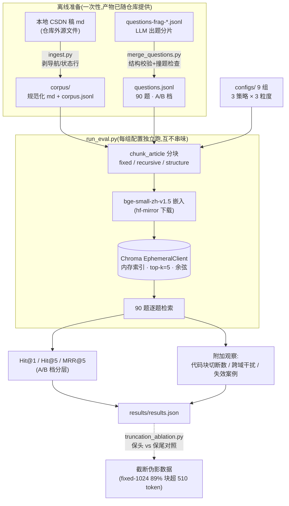

# rag-lab

> 中文技术语料上的 RAG 分块策略实测。配套文章:《RAG 分块策略实测:固定窗口 vs 递归切分 vs 结构感知,用 90 道题说话》(CSDN「RAG 链路实测」专栏第 1 篇)。

## 这是什么

用 9 篇中文技术长文做语料,90 道题做测试集,对比 3 种分块策略 × 3 种粒度共 9 组配置的检索命中率。不是教程,是一份带数字的评测报告。

- **语料**:9 篇中文技术长文(DeepSeek Harness 实测 ×4 / ARC-AGI-3 harness / DseWiki 数据实拉 / SkillSpector 扫描 / GLM 对比 ×2;已发布 6 篇、未发稿 3 篇),约 7 万字
- **测试集**:90 题,分 A 档(主题级)/ B 档(细节级),ground truth 标到文章级
- **固定量**:bge-small-zh-v1.5 嵌入 / Chroma 向量库 / top-k=5 / overlap=50 字符
- **变量**:分块策略(固定窗口 / LangChain 递归切分 / Markdown 结构感知)× chunk 大小(256 / 512 / 1024 字符)

## 管线



设计要点:

- **Chroma 用 `EphemeralClient` 内存模式**:9 组配置各自分块/嵌入互不相同,持久化省不了嵌入计算;跑完即弃,无旧向量残留污染。切持久化的时点在后续重排序实验(固定 chunk 只换 reranker)。
- **单变量原则**:9 组配置里只有策略×粒度在动,嵌入模型/向量库/top-k/overlap 全程固定。

## 复现

```bash
pip install -r requirements.txt
python src/run_eval.py                        # 跑全部 9 组配置(CPU 每组 9~14 秒)
python src/run_eval.py --config configs/recursive-512.json   # 单组
python src/truncation_ablation.py            # 截断伪影对照(文章 2.5 节坑 1 的验证)
```

模型自动从 hf-mirror 下载(国内直连)。结果输出到 `results/results.json`。

`corpus/` 与 `questions.jsonl` 已随仓库预置,clone 后可直接跑评测。`ingest.py` 是语料再生成脚本——其 MANIFEST 指向本机仓库外的源文件路径,对 clone 者预期 `[miss]`,无需运行;新增语料时参照 MANIFEST 注释追加行。

## 目录

```
corpus/                  语料(规范化 md + corpus.jsonl 元数据)
questions.jsonl          测试集(90 题,含 A/B 档标注)
questions-frag-*.jsonl   出题分片(合并前的工作文件,留档复现测试集构建)
configs/                 9 组实验配置(3 策略 × 3 粒度)
src/ingest.py            语料清洗入库(剥系列导航行/状态注记行)
src/chunkers.py          三种分块策略实现 + 代码块切断统计
src/merge_questions.py   题库分片合并 + 结构校验 + 跨篇撞题检查
src/run_eval.py          主评测:分块→嵌入→检索→指标
src/truncation_ablation.py  截断伪影对照:fixed-1024 保头 vs 保尾 510 token
results/results.json     跑批结果(指标 + 失效案例逐题存档)
```

## 指标口径

Hit@1 / Hit@5 / MRR@5,按 A/B 档分层。ground truth 在文章级:top-k 命中目标文章即算 hit。附加观察:代码块被切断次数、跨域干扰计数、失效案例存档(见 results.json 的 misses 字段)。

n=90,报分层观察,不做显著性检验——这是小样本诚实口径。

## License

MIT。语料为本人原创文章,测试集随语料同授权。
